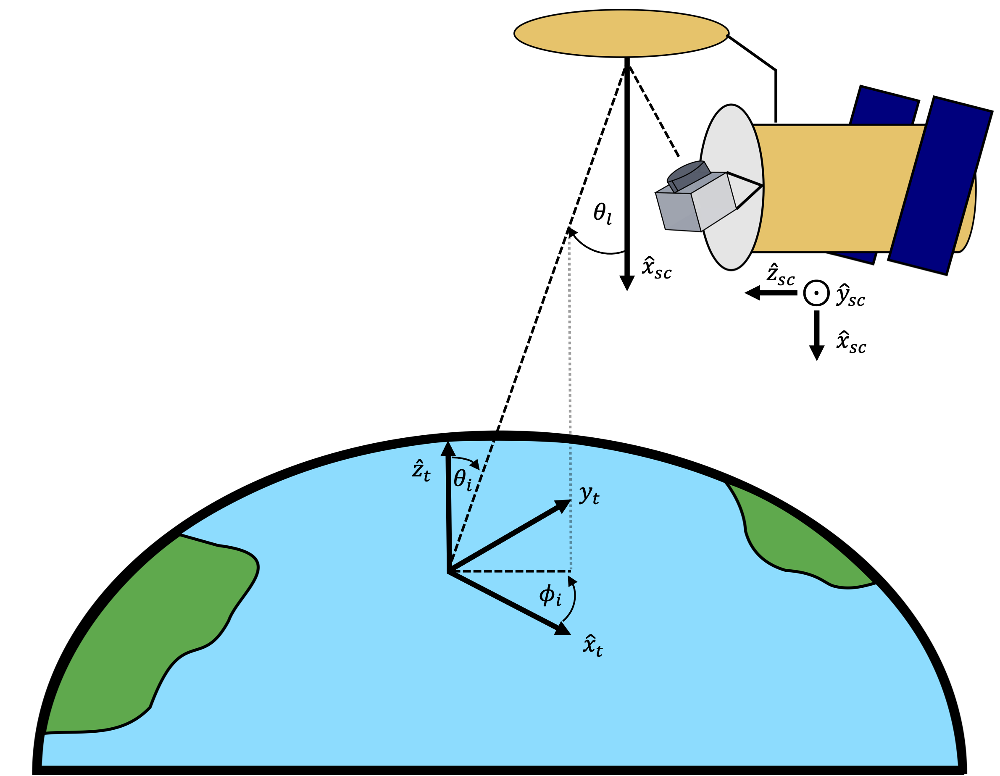

Spacecraft Module 
=======================

The :code:`spacecraft` module defines the spacecraft object, which can be used to simulate spacecraft observations of the Earth. 
Each spacecraft object relies on the `SPICE framework <naif.jpl.nasa.gov>`_, specifically the `SpiceyPy <spiceypy.readthedocs.io>`_ Python API, 
to determine its state and attitude with time. Examples of spacecraft object use can be found in the scripts/ directory, and the general
functionality is described below. If the user is not familiar with SPICE, we encourage them to visit the NAIF webpage and read the 
introductory documentation. 

Before using this module, the user should ensure that the necessary SPICE kernels have been downloaded into FOAM's 
cache directory (~/.foam). This can be done by calling :code:`get_spice_kernels()` from the :code:`foam.utils.config` module (if the user hasn't already
run :code:`get_all_ancillary_data()` from that module).

Setting Up a Spacecraft Object
------------------------------

Upon initialization, the :code:`spacecraft` object loads background SPICE kernels (e.g. Earth's reference frame, leapsecond lists, etc.) into the kernel pool. 
The user must then write the kernels relevant to the :code:`spacecraft` object through the :code:`spacecraft.write_tle_kernels()` method. These kernels are formed from 
`Two Line Element (TLE) sets <www.space-track.org/documentation#tle>`_. Users can provide pre-existing TLE text files to the :code:`write_tle_kernels()` method or generate 
their own using the :code:`spacecraft.get_manual_elems()` method. In addition to establishing spacecraft position and velocity with respect to Earth as a function of time, a spacecraft coordinate system is also generated. For this coordinate system, the unit vector :math:`\hat{x}` points towards the sub-spacecraft point on Earth, the unit vector :math:`\hat{y}` points in the direction of the spacecraft orbital velocity, and the :math:`\hat{z}` axis is orthogonal to :math:`\hat{x}` and :math:`\hat{y}` following the right hand rule. 
This system is illustrated in the figure below. 

After the spacecraft SPICE kernels are written, the user can then specify pointing directions for any number of radiometers using the 
:code:`spacecraft.write_radiometer_ck()` method. Stationary and scanning radiometers can be specified using the arguments to this function, and any number of radiometers
can be specified for a single spacecraft. For convenience, methods are provided to generate spacecraft objects similar to the SMAP and Aquarius missions as 
:code:`make_smap()` and :code:`make_aquarius()`.

Interacting with a Spacecraft Object
------------------------------------

Following the creation of a spacecraft object, the main mode of interaction with the objects are the :code:`spacecraft.make_track_grid()` and :code:`spacecraft.make_obs_grid()` methods. Both of these methods return dictionaries of position and attitude data over a user-specified period of time. The :code:`make_track_grid()` method returns the sub-spacecraft latitude and longitude for each spacecraft. The :code:`make_obs_grid()` (and the experimental :code:`make_parallel_grid()`) method returns pointing information for each radiometer on the spacecraft, specifically the latitude/longitude of the intersection of the radiometer boresight with the surface of the Earth, the topocentric incidence elevation and azimuth angles, and the right ascension and declination in the direction of specular reflection. Also include are flags indicating whether or not the sun or moon is in the path of this specularly reflected vector. The output dictionaries from these methods can then be used to generate brightness temperature maps. These methods are also used by :code:`revisit_time()` to make maps of spacecraft revisit for a given period. An example workflow for generating a spacecraft object, observing dictionary, and revisit time chart are shown below.

.. code-block:: python
    :linenos:

    from foam.spacecraft import spacecraft, strings_to_epochs, revisit_time 
    from foam.utils.mk import manual_furnish 

    eps = strings_to_epochs('2020 MAY 01 12:00 UTC', '2020 JUL 01 12:00 UTC') 
    epoch_res = 10  # seconds

    # Equivalent to foam.spacecraft.make_smap
    manual_furnish()  # Loads SPICE kernels 
    smap_craft = spacecraft()
    # SMAP TLE
    tle = ['1 40376U 15003A   20247.33652497  .00000025  00000-0  13841-4 0  9991',
           '2 40376  98.1240 252.7233 0001762  90.8135 269.3273 14.63327320298611']
    epoch, elements = spice.getelm(2000, 500, tle)
    smap_craft.write_tle_kernels(elems=elements, tle_epoch=epoch, start_epoch=start_epoch, 
                                 end_epoch=end_epoch, epoch_res=epoch_res)
    # look_angle, look_axis, rpm, scan_axis
    smap_craft.write_radiometer_ck(35.5, 'Y', 14.6, 'X')

    # End make_smap utility 

    track_res = 50e-3  # seconds
    grid, lon_bins, lat_bins, obs_dict = revisit_time(smap_craft, *eps, track_res, plots=True, grid_res=0.5)

    # Do things with the observing dictionary results...

    # Close out 
    smap_craft.unload()

API
------------------------------------
.. automodule:: foam.spacecraft
    :members:
    

