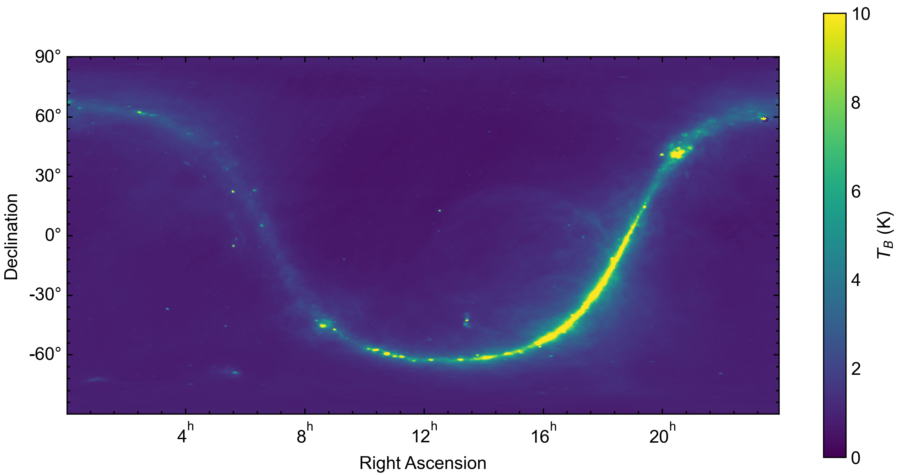

:code:`form_galaxy_tables` 
===================================

:code:`form_galaxy_tables` is a script that is used to generate maps of wind-roughened galactic reflection from ocean surfaces. The rationale and procedures for generating these maps is discussed below. 

At lower frequencies (<3 GHz), the contribution of galactic reflection to measurements of microwave emission over the ocean becomes non-negligible. Models of galactic emission and its reflection from the ocean have been previously developed for L Band radiometer missions such as Aquarius. These models are subtracted from satellite measurements to obtain a higher accuracy brightness temperature from which ocean state parameters can be inferred. For Aquarius, a map of L Band galactic brightness temperature was compiled from ground-based sky surveys. This map is shown below with the cosmic microwave background term subtracted.

    
If the ocean surface was flat, then the contribtuion of reflected galactic radiation could be determined via specular reflection. Unfortunately, this is not the case, as winds over the ocean will roughen the surface. In the subsequent discussion, we will consider several coordinate systems. The first is the celestial equatorial coordinate system, which defines the position of astronomical objects referenced to the J2000 epoch. The location of astronomical objects is defined by their right ascension (similar to azimuth) and declination (similar to elevation), which remain relatively constant as the Earth rotates. The second is the terrestrial reference frame, which rotates with the Earth. At J2000, the equatorial and terrestrial frames are equivalent, with the x axis pointing through the intersection of the equator and prime meridian and the z axis pointing through the geographic north pole. The third is the local reference frame, which is defined following the convention of Yueh 1997. In this convention, the z axis points normal to the Earth's surface and the x axis points in the downwind direction (i.e. the direction in which the wind blows). 

As a first order approximation, the wind-roughened ocean surface has been described as a collection of tilted facets in the local reference frame, each of which is a specular reflector. The density of facets with a particular slope (:math:`S_x, S_y`) within a spatial region measured by radiometer instrument can be modeled using a Gaussian distribution

.. math:: P(S_x, S_y) = \frac{e^{-\frac{S_x^2 + S_y^2}{\sigma^2}}}{\pi \sigma^2}

The Aquarius ATBD assumes a simplified variance :math:`\sigma` as a scalar function of wind speed (:math:`W`) and frequency (:math:`f`). 

.. math:: \sigma^2 = 0.0029 W \textrm{log}_{10}(2f)

The slopes of a given facet can also be determined from the following relationship with the facet normal vector in the local reference frame. 

.. math:: \overrightarrow{n} = \frac{-S_x \hat{x} -S_y \hat{y} + \hat{z}}{\sqrt{S_x^2 + S_y^2 + 1}}

Now that we have an idea of how the roughened ocean surface behaves in response to wind, we can determine the scattering behavior. In the local coordinate system, galactic microwave radiation propagates towards Earth with a direction vector :math:`k_i` and the scattered radiation propagates away from Earth with a direction vector :math:`k_s`. The scattered brightness temperature in the :math:`k_s` direction is as follows (from Wentz 1978). 

.. math:: 

   T_B^\overrightarrow{k_s} = \int\int \Gamma(k_i, k_s) T_B^\overrightarrow{k_i} dk^x_i dk^y_i

   dk^x_i dk^y_i = \textrm{cos}\theta d\theta d\phi

where :math:`\theta=0` points upwards from the surface. The scattering function is defined as follows using mixed slope and local coordinates. 

.. math:: 

    \Gamma(k_i, k_s) = \frac{P_z \left(S_x, S_y \right)}{4 \left(\overrightarrow{k_s} \cdot \overrightarrow{z}\right)\left(\overrightarrow{k_i} \cdot \overrightarrow{z}\right)}\Upsilon

The :math:`\Upsilon` term describes the polarization of the scattered radiation in terms of the initial polarization

.. math:: \Upsilon = \left|\overrightarrow{P_s^*} \cdot \overrightarrow{H_s}\right|^2 \left|R_h\right|^2 + \left|\overrightarrow{P_s^*} \cdot \overrightarrow{V_s}\right|^2 \left|R_v\right|^2

To obtain the approximation maps used by FOAM in celestial equatorial coordinates, it is most useful to have the integral terms be defined in this system. FOAM uses :code:`spiceypy`, a Python implementation of SPICE, to transform between celestial, terrestrial, and local reference frames. The current version of the code can be used to generate nadir-looking maps and will need to be modified to generate architecture specific tables. 

